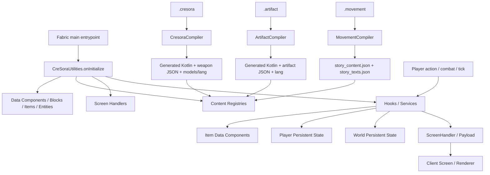

# CreSora Utilities — コードベース構造

> コード、設定、リソース、生成処理を直接探索して再構成した内部構造資料。説明は現在の実装を基準にする。

## 1. 結論

この mod は、単純な機能別パッケージではない。中心にあるのは次の4層である。

1. **Fabric/Minecraft 接続層** — 初期化、イベント、レジストリ、Mixin、画面登録。
2. **コンテンツ層** — JSON レジストリと `.cresora` / `.artifact` / `.movement` DSL。
3. **ゲームサービス層** — プレイヤー、戦闘、報酬、進行、イベントの状態遷移。
4. **表示・操作層** — ScreenHandler と client Screen、独自 payload、レンダラー。

設計上の重要な境界は、**コンテンツ定義はロード時にスナップショット化され、ゲーム中の一時状態はサービスが保持し、永続状態は Player/World PersistentState/Data Component に分散する**ことだ。

## 2. 全体の実行構造



### 2.1 初期化順序

実装上の起点は [`CreSoraUtilities.kt`](src/main/kotlin/hifumi/cresora/CreSoraUtilities.kt) である。`onInitialize()` は概ね次の順で動く。

| 順序 | 処理 | 主な責務 |
|---:|---|---|
| 1 | `ModDataComponents.initialize()` | ItemStack 用データ型をロードし、静的登録を成立させる |
| 2 | Block / Entity / Item の登録 | Minecraft registry に mod 固有オブジェクトを登録 |
| 3 | Content Registry の `init()` | JSON または built-in fallback を Codec で読込 |
| 4 | 定義から Item を生成 | equipment、weapon、fragment、special item を登録 |
| 5 | ScreenHandler と LootFunction を登録 | server/client 間の画面型と loot 拡張を確定 |
| 6 | Hook / Service の `init()` | Fabric イベントと tick 処理を接続 |
| 7 | LootTable MODIFY を登録 | vanilla mob loot に equipment ルールを注入 |

クライアント側は [`CreSoraUtilitiesClient.kt`](src/client/kotlin/hifumi/cresora/CreSoraUtilitiesClient.kt) で、ScreenHandler と Screen の対応、物理レンダラー、Story dialogue payload を登録する。

## 3. リポジトリの責務分割

```text
src/main/kotlin/                 server/runtime
  hifumi/cresora/                entrypoint, shared registration, generic UI
  adventurerank/                 rank, XP, mob scaling, rank rewards
  bloodmoon/                     moon phase, altar, battle, persistent sessions
  combat/                         damage, arena, mob packs, combat feedback
  credits/                        credit currency and reward classification
  debuff/                         custom debuff lifecycle
  domain/                         domain selection, battle, reward flow
  equipment/                      artifact definitions, stats, drops, skills, upgrades
  guide/                          guide tasks and records
  leyline/                        element keys, overflow block, ley line flow
  masquerade/                     character/session switching and support
  musicecho/                      music echo content
  npc/                            spirit guide and dialogue content
  resonance/                      currency, pulls, pity/bond progression
  story/                          chapters, flags, dialogue, battle progression
  treasure/                       chest ownership/session persistence
  weapon/                         weapon data, skills, upgrades, spirit bond
  world/                          regions, portal, world-facing NPC logic

src/client/kotlin/                client-only screens, payload consumers, renderers
src/compiler/kotlin/              DSL lexer/parser/code generators
src/compilerTest/                 compiler tests and golden outputs
src/test/                         runtime/content tests
src/main/cresora/                 authoring source for generated content
src/main/resources/               immutable base resources and JSON content
build/generated/cresora/          generated Kotlin/resource overlay; not source of truth
```

## 4. コンテンツの二つの流れ

### 4.1 手書き JSON を読む流れ

次の Registry は classpath 上の `data/cresora-utilities/cresora/*.json` を `JsonParser` と Minecraft `Codec` で読み、ID 重複や必須構造を検証して map/list に置き換える。

| Registry | 入力ファイル | 実行時の利用先 |
|---|---|---|
| `EquipmentContentRegistry` | `equipment_content.json` | equipment 定義、set、drop profile、mob loot |
| `ArtifactSpecialItemRegistry` | `artifact_special_items.json` | special item と mob drop |
| `ShopContentRegistry` | `shop_content.json` | resource/artifact shop |
| `MobCombatProfileRegistry` | `mob_combat_content.json` | mob の戦闘プロフィール |
| `DomainContentRegistry` | `domain_content.json` | domain の選択・戦闘条件 |
| `DomainRewardProfileRegistry` | `domain_reward_profiles.json` | domain 報酬 |
| `MasqueradeContentRegistry` | `masquerade_content.json` | wave、support、報酬 |
| `StoryContentRegistry` | `story_content.json` | chapter、battle、dialogue、報酬 |
| `ResonanceContentRegistry` | `resonance_content.json` | pull 対象、rarity、bond |
| `MusicEchoContentRegistry` | `music_echo_content.json` | music echo 定義 |
| `NpcDialogueContentRegistry` | `npc_dialogue_content.json` | NPC dialogue tree |
| `RegionContentRegistry` | `region_content.json` | region 境界と unlock rank |

`WeaponContentRegistry` と `EquipmentContentRegistry` は built-in default を先に適用し、リソースがあれば JSON で上書きする。その他の必須 Registry は欠落時に初期化失敗となるものがあるため、resource の optional/required 境界を変更する場合は実装とテストを同時に確認する。

### 4.2 DSL を生成物へ変換する流れ

Gradle の [`compileAssets`](build.gradle) は `compileKotlin` と `processResources` の前に必ず実行される。

```text
src/main/cresora/*.cresora   -> Lexer -> Parser -> CresoraCompiler
                                      -> generated skill Kotlin
                                      -> cwc_weapon_content.json
                                      -> item models / translations

src/main/cresora/*.artifact  -> Lexer -> Parser -> ArtifactCompiler
                                      -> generated artifact handlers
                                      -> cac_artifact_content.json

src/main/cresora/*.movement  -> Lexer -> Parser -> MovementCompiler
                                      -> story_content.json
                                      -> story_texts.json
```

コンパイラの入口は [`Main.kt`](src/compiler/kotlin/hifumi/cresora/compiler/Main.kt)。生成先は `build/generated/cresora/kotlin` と `build/generated/cresora/resources` で、チェックアウト内の resource を直接書き換えない。Gradle は base resource と生成 overlay を結合し、生成対象の checked-in 相当パスを除外する。

## 5. ランタイム状態の配置

| 状態の種類 | 保存場所 | 代表例 | 寿命 |
|---|---|---|---|
| Item の永続データ | `ModDataComponents` | `LEVEL`, `EQUIPMENT_DATA`, `WEAPON_DATA`, session ID | ItemStack と同じ |
| Player の永続/準永続データ | Mixin access bridge + vanilla player data | rank、credits、resonance、story/guide/masquerade progress | player lifecycle / respawn を跨ぐ |
| World の永続データ | `PersistentState` | Blood Moon session、moon phase、treasure chest、masquerade recovery | world save を跨ぐ |
| サービスの一時状態 | singleton service の map/set | cooldown、battle session、hotbar override、transient skill buff | tick / disconnect で掃除 |
| Registry snapshot | `@Volatile` map/list | content bundle | サーバー初期化から終了まで |

`PlayerLifecycleHooks` と各 feature hook の disconnect/respawn 処理は重要な回収地点である。特に武器・artifact の生成 skill が持つ transient map は、生成された `clearTransientState` / `pruneTransientState` と `WeaponSkillService` の掃除経路に依存する。

## 6. サブシステムの構造

### 6.1 Equipment / Weapon

```text
ContentRegistry
  -> Definition / Data / Rarity / Set
  -> Item registration in CreSoraUtilities
  -> StackSupport reads/writes DataComponent
  -> AttributeService calculates combat stats
  -> SkillService dispatches handlers
  -> UpgradeService / DropService / UI mutate progression
```

Equipment は Trinkets item として登録され、weapon は通常 item・fragment item・rarity fragment・role material に分解される。skill 本体は `WeaponSkillRegistry` から `WeaponSkillHandler` を引き、DSL 生成クラスまたは手書き handler を実行する。

### 6.2 Story / Domain / Masquerade

これらは共通して「選択画面 → server-side session → tick/死亡/disconnect 処理 → 報酬・progress 更新」という構造を取る。

- Story: `StoryService`、`StoryProgressService`、`StoryFlagService`、`StoryDialogueNetworking`
- Domain: `DomainService`、`DomainContentRegistry`、`DomainRewardProfileRegistry`
- Masquerade: `MasqueradeService`、`MasqueradeProgressService`、loadout/support handlers、recovery persistent state

Story の会話だけは custom payload の状態を client に送り、[`StoryDialogueClient.kt`](src/client/kotlin/hifumi/cresora/story/StoryDialogueClient.kt) が画面表示を担う。

### 6.3 Blood Moon / World / Ley Line

Blood Moon は通常の戦闘サービスより永続化の比重が高い。`MoonPhaseService` が夜の状態を管理し、`BloodMoonService` が参加者、ベッド保護、wave、報酬を扱い、`BloodMoonPersistentState` と reward chest state が world save に接続する。

Region は毎秒プレイヤー位置を polling し、rank 条件を通過した初回訪問を `StoryFlagService` の `region_visited_<id>` に記録する。したがって world exploration が story flag の入力になる。

Ley Line は element key、選択 screen handler、overflow block、server tick service の組み合わせであり、独立した JSON registry より runtime rule の比重が高い。

### 6.4 Combat / Rewards

戦闘の主要な報酬分配点は [`AdventureRankHooks.kt`](src/main/kotlin/hifumi/cresora/adventurerank/AdventureRankHooks.kt) の hostile death callback である。1回の kill から XP、credits、weapon drop、artifact special drop、moon brick、equipment hook、guide progress、ley line key、resonance currency へ分岐する。

これは便利な集約点である一方、報酬機能を追加すると callback の責務が膨張しやすい。新しい報酬を足す場合は、単にこの callback に処理を追記するのではなく、既存の reward classifier/service へ責務を寄せるべきだ。

## 7. UI と通信

server 側の `ScreenHandlerType` は `CreSoraUtilities.onInitialize()` で登録され、client 側の同じ型に Screen が紐付く。対象は menu、upgrade、weapon、artifact、domain、story、masquerade、resonance、guide/records である。

```text
server command / item interaction
    -> server service validates inventory, rank, session
    -> ScreenHandler opens or sends payload
    -> client Screen renders and sends action
    -> server validates again and mutates authoritative state
```

画面は権威を持たない。入力値の検証、inventory 消費、session 所有権の判定は server 側 handler/service が担当する。`ScreenSyncSupport` は handler の同期値を補助する共通部品である。

## 8. テストが示す契約

テストは次の契約を明示している。

- `src/test`: resonance、domain、story、leyline、equipment、localization、recipe など runtime/content の検証。
- `src/compilerTest`: lexer/parser、typed action、area of effect、movement、artifact lifecycle、generated resource isolation、golden codegen。
- `build.gradle`: 通常の `check` が `compilerTest` を含む。

特に compiler の golden test は、DSL の意味論だけでなく生成 Kotlin/JSON の出力形式そのものを API として扱っている。コンパイラ変更では parser test、golden test、`compileAssets`、`classes` の順に見るのが最短である。

## 9. 変更時の探索手順

### コンテンツを追加する場合

1. 定義形式を決める（JSON か DSL か）。
2. 対応する `*ContentRegistry` の Codec と `init()` を確認する。
3. Item/Block/UI が必要なら [`CreSoraUtilities.kt`](src/main/kotlin/hifumi/cresora/CreSoraUtilities.kt) の登録順を確認する。
4. DSL なら `AST.kt` → `Parser.kt` → 各 Compiler → generated output の順に追う。
5. server service が参照する ID と translation/model を同時に確認する。

### runtime 挙動を変更する場合

1. 入口イベントを探す（`*Hooks.kt`、`Commands.kt`、item interaction、tick）。
2. authoritative service の session/state を特定する。
3. respawn、disconnect、world unload、server restart の回収経路を確認する。
4. ItemStack / Player / World のどこに状態を置くべきかを決める。
5. Screen がある場合、client ではなく server validation を変更する。

## 10. 構造上の注意点

- 初期化順序が registry と item 生成の契約になっている。定義を読む前に定義依存 item を作ると破綻する。
- 生成 resource は build overlay が正本であり、`build/generated` を手編集しても次回ビルドで消える。
- fallback を持つ registry と、欠落時に fail-fast する registry が混在する。新しい content の扱いを既存実装から推測してはいけない。
- 多くの service が singleton であるため、static map の寿命と cleanup hook が実質的なメモリ安全性を決める。
- kill callback、server tick、ScreenHandler action は複数機能の交差点である。変更時は局所修正に見えても、報酬・進行・永続化・UIの四方向を確認する必要がある。

## 11. 主要な参照点

- 初期化・登録: [`CreSoraUtilities.kt`](src/main/kotlin/hifumi/cresora/CreSoraUtilities.kt)
- client wiring: [`CreSoraUtilitiesClient.kt`](src/client/kotlin/hifumi/cresora/CreSoraUtilitiesClient.kt)
- persistent component: [`ModDataComponents.kt`](src/main/kotlin/hifumi/cresora/ModDataComponents.kt)
- asset build pipeline: [`build.gradle`](build.gradle)、[`Main.kt`](src/compiler/kotlin/hifumi/cresora/compiler/Main.kt)
- weapon model: [`WeaponContentRegistry.kt`](src/main/kotlin/hifumi/cresora/weapon/WeaponContentRegistry.kt)、[`WeaponSkillService.kt`](src/main/kotlin/hifumi/cresora/weapon/WeaponSkillService.kt)
- equipment model: [`EquipmentContentRegistry.kt`](src/main/kotlin/hifumi/cresora/equipment/EquipmentContentRegistry.kt)、[`EquipmentEffectHookService.kt`](src/main/kotlin/hifumi/cresora/equipment/EquipmentEffectHookService.kt)
- cross-feature combat entry: [`AdventureRankHooks.kt`](src/main/kotlin/hifumi/cresora/adventurerank/AdventureRankHooks.kt)
- compiler model: [`AST.kt`](src/compiler/kotlin/hifumi/cresora/compiler/AST.kt)、[`Parser.kt`](src/compiler/kotlin/hifumi/cresora/compiler/Parser.kt)
