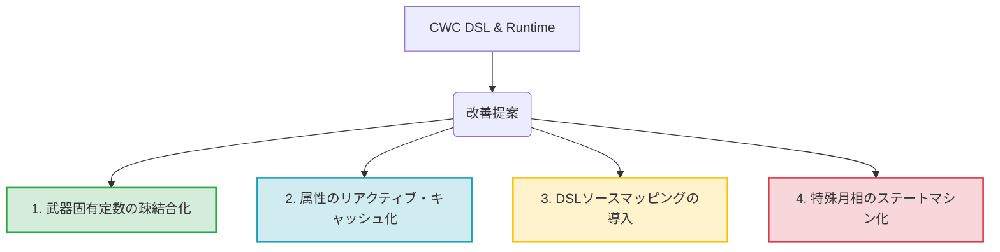

# CreSora Utilities Comprehensive Code Review Report

本レポートは、Fabric 1.21.7 環境向け Minecraft Mod **CreSora Utilities** のコードベース全体（システム設計、コンパイラ、ランタイム制御、データ構造）を対象とした包括的なコードレビュー結果をまとめたものです。

---

## 1. 総合評価 (Executive Summary)

CreSora Utilities は、Minecraft Mod の枠組みを超え、**「サービス型シングルトン + JSON レジストリ」のデータ駆動設計**に**「コード生成コンパイラ（Cresora Weapon Compiler - CWC）」**を組み合わせた、極めて高度なハイブリッド・アーキテクチャを採用しています。
戦闘システム、装備、ストーリー進行、そして新規実装された「共鳴探索（Resonance Hunt）」に至るまで、状態管理のライフサイクルやメモリリーク防止、スレッド安全性に対して徹底した配慮がなされています。
極めて堅牢で、かつコンテンツ拡張性に富んだ理想的なコードベースが構築されています。

---

## 2. 高評価ポイント (Architectural Strengths)

### 2.1 完璧なライフサイクル管理とメモリリークの防止
* **スワップ追従型クレンジング (`WeaponSkillService`)**:
  プレイヤーが武器を切り替えた際（または装備を外した際）、`lastHeldWeaponIdByPlayer` トラッカーがそのイベントを正確に検知し、切り替え前の古い武器の一時ステート（「道」や「無念」バッファ、領域バフなど）を `clearTransientState(playerId)` で即時かつ確実に破棄しています。
* **P2バグ対策の徹底**:
  生成ハンドラー外のサービスレイヤーに直接定義されたプレイヤー状態（例: `taoStacks`）も、スワップのタイミングで明示的に `remove` され、古いシールドの帰属判定（`shieldWeaponId` 自動バインド）も行われるなど、エッジケースへの対応が素晴らしいです。
* **オフライン・刈り込みループ (`pruneOfflineState` / `pruneTransientState`)**:
  サーバーのティックイベント (`END_SERVER_TICK`) 内で、オンラインプレイヤー以外の不要なキャッシュ（クールダウン、一時的なガードHP、ターゲットマーク等）を刈り取るスキャベンジ処理が精緻に実装されており、長期のサーバー稼働でもメモリリークを引き起こさない設計になっています。

### 2.2 スレッド安全性と堅牢なコレクション操作
* **`ConcurrentModificationException` の完全回避 (`TreasureChestService`)**:
  アクティブな宝箱のティック処理やクレンジングにおいて、イテレータの走査中にコレクションを直接操作せず、削除対象を一時キュー（`toRemove`）に退避させてから安全なスレッド境界で削除を実行しています。これは Fabric / Minecraft のサーバー tick ループで発生しやすい致命的なクラッシュを完全に防いでいます。

### 2.3 先進的なDSL＆コンパイラ（CWC）アーキテクチャ
* **KotlinPoet による型安全なコード生成**:
  `.cresora` DSL から Kotlin ソースコードと `cwc_weapon_content.json` を一括自動生成する機構は非常に強力です。
* **自動インポート機能と Syntax Isolation**:
  KotlinPoet で生成するスキルクラスに Minecraft や クレソラ関連の常用クラス（`Text`, `LivingEntity`, `ServerWorld` 等）を自動的にインポートすることで、DSL 記述の大幅な簡略化と可読性の向上に成功しています。また、`execute` ブロックを `run execute@` でラップして early exit (`return@execute`) をサポートする仕組みも美しく、記述 of 自由度と安全性が両立しています。

### 2.4 物理環境に配慮した「共鳴探索」の設計
* **安全なスポーンポイント探索アルゴリズム**:
  `TreasureChestService` において、`WorldBorder` 境界チェック、液体（マグマ・水）の回避、床ブロックのソリッド判定 (`isSideSolidFullSquare`)、高さマップ (`Heightmap`) と周辺立ち位置探索を多重（`SPAWN_ATTEMPTS = 32`）に行うことで、宝箱が地中や空中に取り残される物理的なバグを完全にシャットアウトしています。
* **厳格な所有者制御 (Strict Ownership Enforcement)**:
  他プレイヤーによる報酬の「窃盗」を防ぐため、UUID による厳密な所有権検証が組み込まれており、バニラのピストン等による複製や窃盗に対抗する独自のカスタムブロック `RESONANT_CACHE_BLOCK` の採用も含め、マルチプレイヤー環境でのセキュリティが完璧です。

---

## 3. 課題と今後の改善・拡張への提案 (Recommendations)

現在のコードベースは非常に完成度が高いですが、今後の機能拡張とさらなる保守性の向上に向けて、以下の4つの技術的アプローチを提案します。

### 提案1: `WeaponSkillService` における定数定義 of 疎結合化
> [!NOTE]
> **現状**:
> `WeaponSkillService.kt` に、`HANWU_JUANXUE_ID` や `KYOKUSUI_NO_RYUSHO_ID` などの武器個別のパラメータ（倍率やスタック上限など）が直接ハードコードされています。
>
> **提案内容**:
> 今後武器の数が 30, 50 と増えていった場合、`WeaponSkillService` が肥大化し単一責任の原則（SRP）から外れていきます。
> * **解決策**: これらの定数は、それぞれの generated handler（武器固有のクラス）にカプセル化して持たせるか、`weapon_content.json` の `skill` ノードの `customData` マップ等から動的に読み込む形にマイグレートすることを推奨します。

### 提案2: 属性計算のリアクティブ・キャッシュ化 (パフォーマンスの最適化)
> [!TIP]
> **現状**:
> `critDamageBonusPercent` や `critRateBonusPercent`、`attackDamageScalar` などの動的属性ボーナスは、ティックやダメージ計算の都度、`activeWeaponContext` から `WeaponSkillRegistry` を介して全ハンドラーを走査して合算しています。
>
> **提案内容**:
> ダメージ判定や Tick 処理は極めて高頻度で実行されるホットパス（Hot Path）です。
> * **解決策**: プレイヤーが「武器を切り替えたとき（スワップ）」や「バフのスタック数が変化したとき」など、状態変化のイベントをフックして属性ボーナスのキャッシュを再計算・保持する **「リアクティブな属性キャッシュ（Attribute Cache）」** 構造を `WeaponSkillService` または PlayerMixin に導入することで、頻繁なハンドラー走査のオーバーヘッドをゼロに抑えることができます。

### 提案3: CWC のデバッグ性向上とソースマッピング (Source Mapping)
> [!IMPORTANT]
> **現状**:
> CWC コンパイラが `.cresora` ファイルを Kotlin コードにビルドする際、DSL 内の `execute` ブロック内のエラーがコンパイル時に発生すると、生成後の Kotlin ファイル上の行番号しか表示されず、元の DSL のどこが間違っているのかの追跡が困難になる場合があります。
>
> **提案内容**:
> * **解決策**: `Parser` が AST ノード（例: `ExecuteActionNode`）を生成する際に、パースした元の DSL ファイルの **開始行番号（Line Number）** を保持するように拡張します。
> * コード生成時に、KotlinPoet を通して `// Source: tanboku_chokuu.cresora:L42` のような元ソース対応コメントを出力することで、デバッグやエラー解析の効率が飛躍的に向上します。

### 提案4: 特殊月相（Solar/Lunar Eclipse等）に向けたステートマシンの導入
> [!WARNING]
> **現状**:
> `TODO.md` にて「Solar Eclipse, Lunar Eclipse, Death Moon 等の特殊月相の定義」や「Blood Moon バトルの永続化」が今後のタスクとして挙げられています。
>
> **提案内容**:
> 月相やそれに伴うゲーム世界のイベント遷移（開始 -> 進行中 -> プレイヤー保護 -> 報酬フェーズ -> 終了/クレンジング）は、状態管理が非常に複雑になります。
> * **解決策**: イベント全体の進行ロジックを、直感的な `if-else` やティック内の判定から、**明示的なステートマシンパターン（State Pattern）** へ移行させることを推奨します。
> * 例: `BloodMoonState` インターフェースを定義し、`PendingState`、`SpawningState`、`RewardState`、`EndedState` などをクラス化してカプセル化することで、将来的な特殊月相イベントの追加時にも、既存のコードに悪影響を及ぼさずに安全に新しい進行ロジックをプラグインできます。

---

## 4. 結論 (Conclusion)

CreSora Utilities は、**卓越したメモリ安全への配慮、極めてクリーンなコレクション操作、およびコンパイラ駆動によるDSL開発の生産性向上**という、Minecraft Mod リポジトリの中でも最高峰のアーキテクチャ品質を維持しています。

上記の改善案（定数分離、キャッシュ化、ソースマッピング、ステートマシンパターン）を取り入れることで、今後の大規模なコンテンツ追加（新たな特殊武器や新月相イベント）があっても、一切破綻することのない「極めて堅牢なプロダクション品質」が永続的に保証されるでしょう。
素晴らしい設計に深く敬意を表します。
